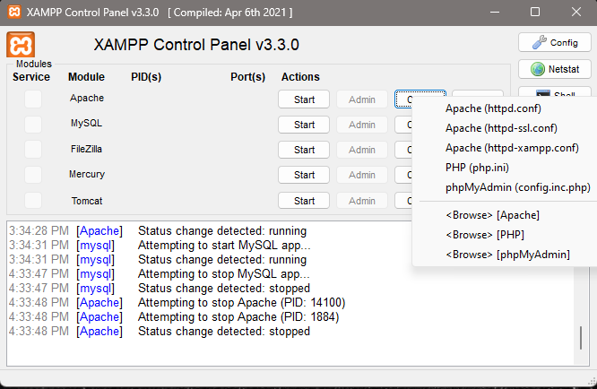

# Testing Environment Setup

## Prerequisites
Before you start, ensure the following tools are installed on your machine:

- **Composer**
  - **Windows**: Download "Composer-Setup.exe" from the [Composer Website](https://getcomposer.org/download/)
  - **Linux/Mac**:  
    ```sh
    php -r "copy('https://getcomposer.org/installer', 'composer-setup.php');"
    php -r "if (hash_file('sha384', 'dac665fdc30fdd8ec78b38b9800061b4150413ff2e3b6f88543c636f7cd84f6db9189d43a81e5503cda447da73c7e5b6') { echo 'Installer verified'; } else { echo 'Installer corrupt'; unlink('composer-setup.php'); } echo PHP_EOL;"
    php composer-setup.php
    php -r "unlink('composer-setup.php');"
    ```

- **XAMPP**  
  - Download from [Apache Friends](https://www.apachefriends.org/download.html).

## Local Testing Setup

Due to the CI pipeline configuration, we cannot rely on `localhost` on the default port 80. Instead, we must serve the project on **port 8000**. This requires some adjustments to your **XAMPP Apache configuration** and **virtual host setup**.

### **Steps to Conifigure Apache on XAMPP**

1. **Modify Apache Configuration to Listen on Port 8000:**

    Open the Apache configuration file by clicking on **Apache (httpd.conf)**: <br>
     <br>

    Find ```Listen 80``` and change it to ```Listen 8000``` <br>

    In the same file, find ```ServerName localhost:80``` and change it to ```ServerName localhost:8000```

2. **Set Up a Virtual Host:**

    Open the virtual host configuration file by navigating to the following directory:
    
    ```$XAMPP_DIR\apache\conf\extra\httpd-vhosts.conf```

    $XAMPP_DIR is a temporary place holder, but for most Windows users it will be ```C:/xampp```

    Add the following at the end of the file:

    ```html
    <VirtualHost *:8000>
        DocumentRoot "path/to/your/repo"
        ServerName localhost
        <Directory "path/to/your/repo">
            AllowOverride All
            Require all granted
        </Directory>
    </VirtualHost>
    ```

### **Steps to Run Tests Locally**

Once your XAMPP is configured and you have composer installed, startup Apache and MySQL and head to your repo using the CLI. 

To initialize the testing setup insert the following commands:

```sh
composer install
vendor/bin/codecept bootstrap
```

One this is complete you will now be able to run the tests locally with the following command:

```sh
.\vendor\bin\codecept run
```

## Requirements for Writing Tests
Now that your testing environment is setup you can begin to write your own tests. For the tests to function there are some rules that need to be followed

1. **Database Address Handling using `$DB_HOST`** <br>
        Due to the requirements of the CI pipeline we cannot use the variable `localhost` or the address `127.0.0.1` for all database connections. Instead we need to 
        use the internal address used by docker which is `172.18.0.1`. For this I have created a global variable in config.php that will choose the necessary address 
        based on whether the code is being run locally or in the CI pipeline. This means that at the beginning of each of your files that connect to the database you 
        must include the following line:

```php
require '../config.php'
```
A connection using mysqli will now have to look like this: 
```php
$conn = mysqli_connect($DB_HOST, 'gradeplusclient', 'gradeplussql');
```
There is one exception to this rule and it is if you are trying to connect to the database using the root user. Then you can use the address `127.0.0.1`.